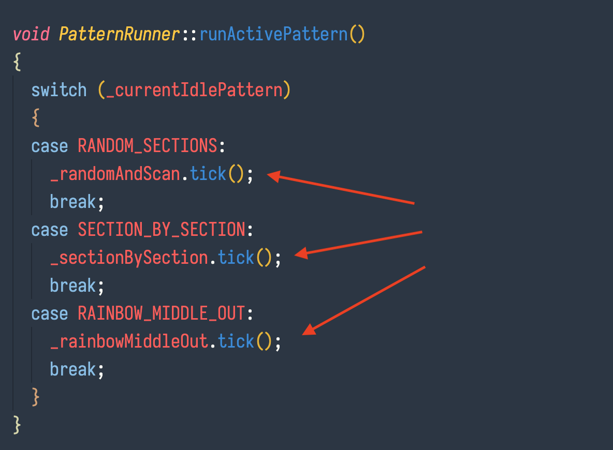

# LI Light

## Overview

I made the LI Light primarily to explore some physical and code ideas/concepts and partially to have something cool in my background during video meetings :P

The piece is made of LED acrylic over a 3d printed shape that acts as a light mask in the shape of the logo. It's driven by an Adafruit Trinket M0 and housed in a shadow box from Ikea.

## The patterns

The code runs 3 patterns, the code for each can be found in the `lib/pattern-runner/patterns/` directory.

### Rainbow

### Random + Scan

### Section by section fill

A touch pad on the back panel uses a capacitive touch sensor built into the Trinket M0 to detect a touch on a copper pad.

The capacitive touch library being used is the [Adafruit_FreeTouch](https://github.com/adafruit/Adafruit_FreeTouch) library (it wasn't available via the arduino or platformio registeries so I had to copy it in, I didn't write that bit of code ;) ).

## SectionManager

A bit of dependency code that I _DID_ write separate from this project is the [FastLED_SectionManager](https://github.com/chris-schmitz/FastLED-Section-Manager).

The gist is that the SectionManager library organizes and groups index ranges for a length of addressable LEDs in a way that allows you to treat grouped sections of indexes as if they're one strip. (This feels like a horrible explanation, I did a better job in the readme for the SectionManager so check it out there ;P).

I wrote the SectionManager as a spin off project for this one and made it as a separate library because I can see myself using the same logic in future projects.

## Cool little details

### Non-blocking patterns

I knew I wanted to have multiple patterns with a way of switcing between them, so I opted for a capactitive touch sensor to act as a pattern switch trigger.

Actually, if you dive back through the git history the original idea was to use an ultrasonic sensor with different ranges to trigger an idle pattern shuffle vs a primary animation trigger.

Regarless of the trigger mechanism, all of the patterns need to be non-blocking.

If you look in the `PatternRunner.cpp` you'll notice that the when `runActivePattern` is fired, it's calling a tick method on whichever pattern class is considered active:

Basically the whole setup is a big state machine firing on a regular interval where the tick advances a given pattern by one step. So all of the patterns are non blocking with one exception being the scan animation part of the `RandomAndScan` class. That one is intentionally blocking because I though the whole animation was super cool and I didn't want someone to cut it off part way through it ;P

_Also, note that I definitely realize that it would make sense to introduce an abstract `Pattern` base class and make the `tick` method and possibly a `reset` method virtual to enforce them in the pattern classes, but holy cow I need to stop working on this project at some point!_

### Adafruit's color wheel

As part of the `RainbowMiddleOut` pattern I use a couple of helper functions to calculate positions on a color wheel and convert 8 bit RGB values into a unsigned 32 bit number. Both of these functions are adapted from similar helper functions in the [Adafruit Neopixel library](https://github.com/adafruit/Adafruit_NeoPixel). The only real difference in my helper functions are that they're written to pass around basic number types instead of the structs that the neopixel library uses, but other than that the concepts in the code are the same so def want to attribute credit to them.

### Circuit board design

This light and the couple of others that I'll be making use the first custom circuit board that I've had manufactured.

I've designed custom boards before and milled them out on the Bantam OtherMill down at [MADE](), but this is the first that I've actually sent out to a PCB manufacturer to be professionally manfactured :D

### Custom 3D parts

All of the physical fabrication outside of the actual shadowbox itself are 3d printed parts that I modeled in Fusion 360 and printed out on my Prusa MK3s

I made a light for my wife's company before this and used a laser cut piece of plywood to mount the logo mask int the middle of the shadowbox.

This worked pretty well, but I wanted something that I could produce at home and that required less material. Coming up with the custom centering mounts made the process much easier.

## Thoughts

Overall I'm super happy with this project. There are (as always) other things that I'd like to do to the code base and fabrication, but I think this is a good stopping point.

This was also a really nice and formative exploration into object oriented C++ for me. Most of my previous projects are very procedural with maybe light OOP, but in this project I decided to lean into it and build some practical OOP-in-CPP learnings. While it may not be stellar code, I feel like it's fairly clean and I def learned a ton while doing it.

I have ideas for making a couple of more light designs similar to this, but for now I'm going to crank out a couple more for co-workers and call it a day. I have a couple of other ideas I want to hop to which will be fun to figure out!
